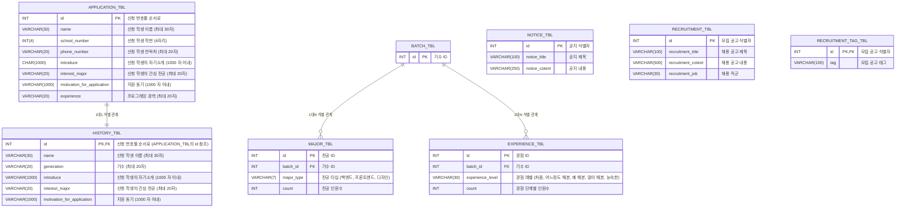

# Equus-Recruitment

```mermaid
erDiagram
    APPLICATION_TBL {
        INT id PK "신청 번호를 순서로"
        VARCHAR(30) name "신청 학생 이름 (최대 30자)"
        INT(4) school_number "신청 학생 학번 (4자리)"
        VARCHAR(20) phone_number "신청 학생 연락처 (최대 20자)"
        CHAR(1000) introduce "신청 학생의 자기소개 (1000 자 이내)"
        VARCHAR(20) interest_major "신청 학생의 관심 전공 (최대 20자)"
        VARCHAR(1000) motivation_for_application "지원 동기 (1000 자 이내)"
        VARCHAR(20) experience "프로그래밍 경력 (최대 20자)"
    }

    HISTORY_TBL {
        INT id PK, FK "신청 번호를 순서로 (APPLICATION_TBL의 id 참조)"
        VARCHAR(30) name "신청 학생 이름 (최대 30자)"
        VARCHAR(20) generation "기수 (최대 20자)"
        VARCHAR(1000) introduce "신청 학생의 자기소개 (1000 자 이내)"
        VARCHAR(20) interest_major "신청 학생의 관심 전공 (최대 20자)"
        VARCHAR(1000) motivation_for_application "지원 동기 (1000 자 이내)"
    }

    BATCH_TBL {
        INT id PK "기수 ID"
    }

    MAJOR_TBL {
        INT id PK "전공 ID"
        INT batch_id FK "기수 ID"
        VARCHAR(7) major_type "전공 타입 (백엔드, 프론트엔드, 디자인)"
        INT count "전공 인원수"
    }

    EXPERIENCE_TBL {
        INT id PK "경험 ID"
        INT batch_id FK "기수 ID"
        VARCHAR(30) experience_level "경험 레벨 (처음, 어느정도 해본, 꽤 해본, 많이 해본, 능숙한)"
        INT count "경험 단계별 인원수"
    }

    NOTICE_TBL {
        INT id PK "공지 식별자"
        VARCHAR(100) notice_title "공지 제목"
        VARCHAR(250) notice_cotent "공지 내용"
    }

    RECRUITMENT_TBL {
        INT id PK "모집 공고 식별자"
        VARCHAR(100) recruitment_title "채용 공고 제목"
        VARCHAR(500) recruitment_cotent "채용 공고 내용"
        VARCHAR(30) recruitment_job "채용 직군"
    }

    RECRUITMENT_TAG_TBL {
        INT id PK, FK "모집 공고 식별자"
        VARCHAR(100) tag "모집 공고 태그"
    }
    
    APPLICATION_TBL ||--|| HISTORY_TBL : "1대1 식별 관계"
    BATCH_TBL ||--o{ MAJOR_TBL : "1대N 식별 관계"
    BATCH_TBL ||--o{ EXPERIENCE_TBL : "1대N 식별 관계"
```
